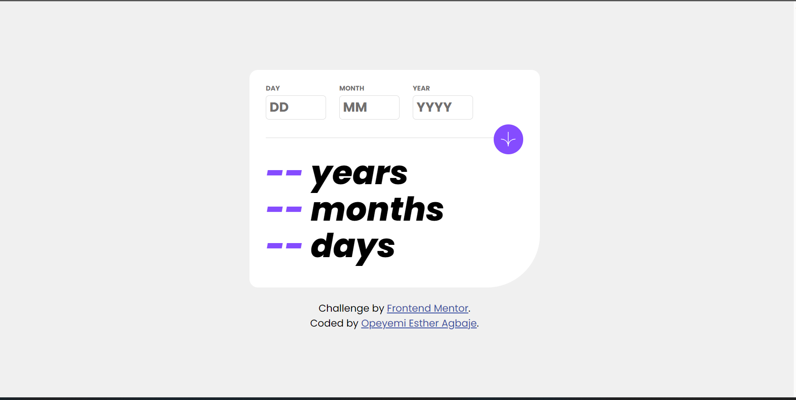
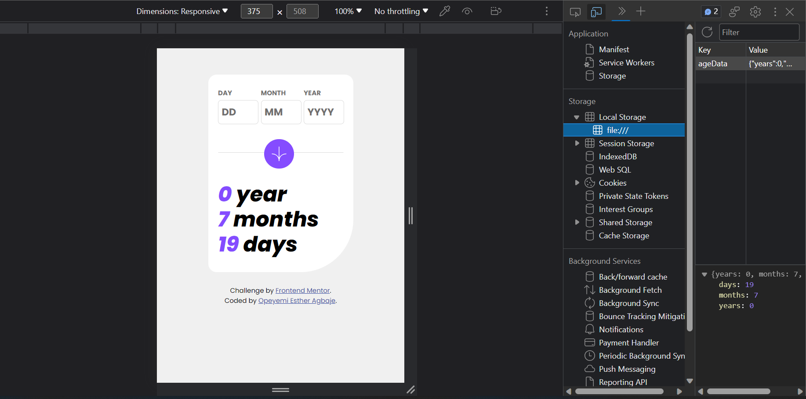
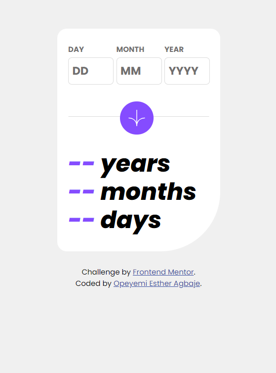
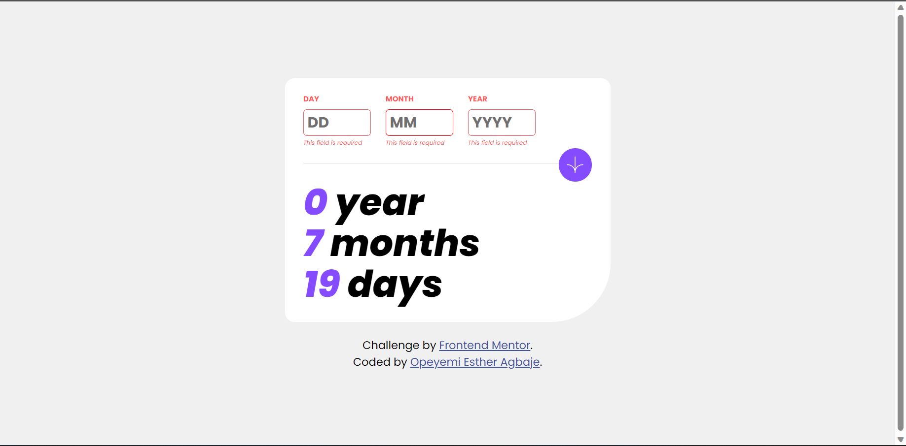
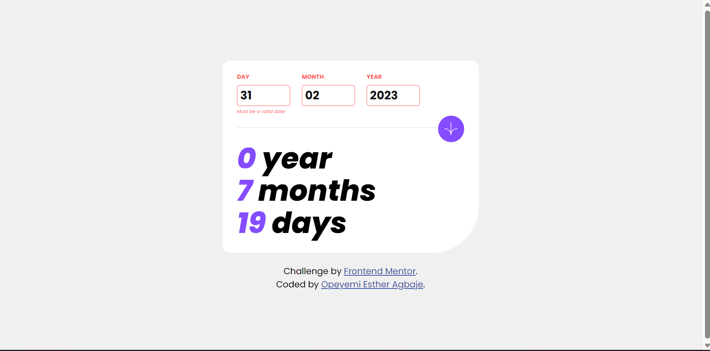
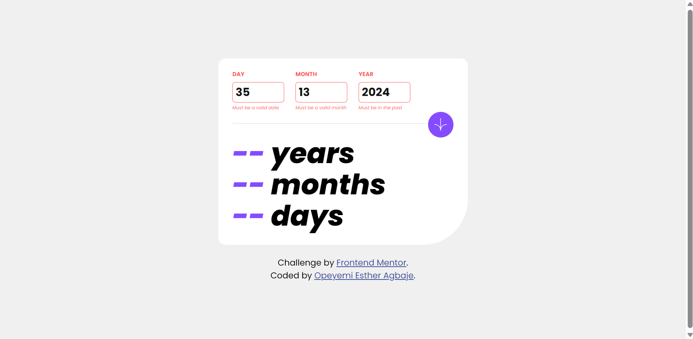

# Frontend Mentor - Age calculator Application Solution

This is a solution to the [Age calculator app challenge on Frontend Mentor](https://www.frontendmentor.io/challenges/age-calculator-app-dF9DFFpj-Q). Frontend Mentor challenges help you improve your coding skills by building realistic projects.

## Table of contents

- [Overview](#overview)
  - [The challenge](#the-challenge)
  - [Screenshot](#screenshot)
  - [Links](#links)
- [My process](#my-process)
  - [Built with](#built-with)
  - [What I learned](#what-i-learned)
    - [HTML](#html)
    - [CSS](#css)
    - [JavaScript](#javascript)
  - [Continued development](#continued-development)
- [Author](#author)
- [License](#license)

## Overview

### The challenge

Users should be able to:

- View an age in years, months, and days after submitting a valid date through the form
- Receive validation errors if:
  - Any field is empty when the form is submitted
  - The day number is not between 1-31
  - The month number is not between 1-12
  - The year is in the future
  - The date is invalid e.g. 31/04/1991 (there are 30 days in April)
- View the optimal layout for the interface depending on their device's screen size
- See hover and focus states for all interactive elements on the page
- **Bonus**: See the age numbers animate to their final number when the form is submitted

### Screenshot

### Links

- [Live Link](https://agecalc-esteriella.vercel.app)

## My process

### Built with

- HTML
- CSS
- JavaScript

### What I learned

#### HTML

In the process of writing the HTML code, I gained the following insights:

1. **Favicon:**
   - I discovered how to link a favicon image to the browser tab using the `<link>` element.

2. **Semantic HTML:**
   - I learned about the importance of using semantic HTML elements to structure the content meaningfully.
   - I learned the use of `<main>`, `<section>`, `<label>`, `<input>`, `<button>`, and `<small>` elements for various parts of the page.

3. **Division of Sections:**
   - I learned how to structure the content into sections such as input fields, calculation button, calculated age display, and attribution.

#### CSS

In the process of writing the CSS code, I learned the following:

1. **Font Import and Styling:**
   - I understood how to use `@font-face` to import custom fonts, including variations like bold, italic, and bold italic.
   - I learned how to apply font styles using `font-family`, `font-weight`, and `font-style`.

2. **Input Styling:**
   - I understood how to remove the default spin buttons on number inputs.

3. **CSS Pseudo-elements and Positioning:**
   - I learned how to create a horizontal line (`
`) using CSS.
   - I learned the use of pseudo-elements (`::placeholder`, `::focus`) to style input placeholders and focus state.
   - I understood how to position elements using `float`, `position`, and `transform`.

4. **Media Queries:**
   - I learned about media queries (`@media`) to apply different styles for different screen sizes.
   - I saw how the layout, font size, and other properties were adjusted for mobile devices.
   - I learned how to adjust the layout and font sizes for mobile devices using media queries.

5. **Negative Margins and Font Sizing:**
    - I observed the use of negative margins (`margin-bottom: -20px`) for fine-tuning layout.
    - I learned how to adjust font size for age spans to create visual hierarchy.

#### JavaScript

In the process of writing the script that implemented form validation and age calculation features. As an entry-level developer working with this code, I learned the following:

1. **Form Input Handling:**
   - I learned how to retrieve input values from HTML input elements using the `document.getElementById` and `value` properties.
   - I understood how to utilize `parseInt()` to convert string values into integers for calculations.

2. **Validation Logic:**
   - I learned how to perform input validation for day, month, and year fields.
   - I gained an understanding of checking whether input values were numbers or NaN (Not-a-Number).
   - I discovered how to update styles (colors, borders) and display error messages using JavaScript.

3. **Date Manipulation:**
   - I learned how to create a JavaScript `Date` object to represent specific dates.
   - I understood how to create and manipulate dates for comparing input birthdates with the current date.
   - I learned to calculate the difference in years, months, and days between two dates.

4. **Local Storage:**
   - I learned how to store data within the browser's local storage using `localStorage.setItem`.
   - I gained insight into retrieving stored data using `localStorage.getItem` and parsing it as JSON.

5. **DOM Manipulation:**
   - I understood how to update HTML element content using the `textContent` property.
   - I learned to dynamically change CSS styles by modifying style properties.

6. **Function Calls and Flow:**
   - I learned how to define and call functions to modularize my code.
   - I grasped how to utilize function return values to determine whether further execution was necessary.

7. **Error Handling:**
   - I saw how to manage validation errors by returning `false` to prevent further execution.

8. **Commenting:**
   - I recognized the significance of adding comments to explain the purpose of functions, code blocks, and complex logic.

9. **Local Storage Management:**
   - I learned how to remove items from local storage using `localStorage.removeItem`.
   - I discovered how to check for an item's presence in local storage using `localStorage.getItem`.

10. **JSON Handling:**
    - I learned how to create JSON objects, convert them into strings, and parse JSON strings back into objects.

11. **Async Function:**
    - I encountered an example of using an asynchronous function (`getStoredData`) to retrieve data from local storage.

12. **Code Organization:**
    - I understood how to structure code by creating separate functions for validation, age calculation, local storage, and data retrieval.

Through my work with this code, I gained hands-on experience in form validation, date manipulation, local storage, and utilizing JavaScript to elevate interactivity and functionality in a web application.

### Continued development

As a developer, there are several areas that I would want to focus on for continued development and improvement in future projects:

1. **JavaScript Fundamentals:** Strengthen my understanding of JavaScript's core concepts, such as functions, loops, conditional statements, and data types. This will lay a solid foundation for building more complex interactivity in my web applications.

2. **Advanced CSS Techniques:** Explore advanced CSS techniques like animations, transitions, and transforms to enhance the visual appeal of my projects. Learning about Flexbox and CSS Grid in more depth will also help me create sophisticated layouts.

3. **Responsive Design:** Dive deeper into responsive design principles and techniques to create seamless user experiences across various devices and screen sizes. I want to master media queries and viewport units for more precise control over responsive styling.

4. **DOM Manipulation:** Build more complex interactions using DOM manipulation. Practice working with event listeners, dynamically creating elements, and handling user input effectively.

5. **Asynchronous Programming:** Deepen my understanding of asynchronous programming in JavaScript, including concepts like promises and async/await. This will enable me to handle data fetching and asynchronous tasks more efficiently.

6. **Version Control (Git):** Learn how to use Git more effectively for version control and collaborative development. This includes branching, merging, and resolving conflicts.

7. **Accessibility:** Focus on creating web applications that are accessible to users with disabilities. Learn about ARIA roles, semantic HTML, and other practices that improve accessibility.

8. **Performance Optimization:** Explore techniques to optimize the performance of my web applications, including lazy loading, minification, and optimizing images. This will ensure that my websites load quickly and efficiently.

9. **Package Managers and Build Tools:** Familiarize myself with package managers like npm and build tools like Webpack. These tools can streamline development, manage dependencies, and improve project organization.

10. **UI/UX Design Principles:** Gain a better understanding of user interface and user experience design principles. This will help me create more intuitive and user-friendly web interfaces.

11. **Testing and Debugging:** Learn about different testing approaches, including unit testing and end-to-end testing. Practice debugging techniques to identify and fix issues in my code.

12. **API Integration:** Explore integrating third-party APIs to add dynamic content and functionality to my projects. This can include weather APIs, social media APIs, and more.

13. **Personal Projects and Practice:** Regularly work on personal projects to apply and solidify the concepts I've learned. Experiment with new technologies and tools to expand my skill set.

14. **Continuous Learning:** Stay updated with the latest web development trends and technologies by following blogs, online courses, and attending webinars or meetups.

By focusing on these areas, I can continue to grow as a developer and create more polished, feature-rich, and user-friendly web applications in my future projects.

## Author

- [Opeyemi Esther Agbaje](https://github.com/esteriella)

## License

This project is licensed under the [MIT License](LICENSE).
